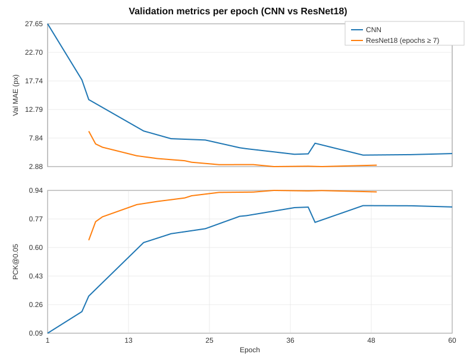

# ai-posedetection-radar

This repository contains experiments for 2D human pose estimation from FMCW radar heatmaps on the P1 dataset.  
The main focus is comparing a lightweight CNN backbone against a ResNet-based backbone, and inspecting their
predictions frame‑by‑frame.

## Data layout (P1)

Radar data is expected under `P1/` in nested folders, for example:

- `P1/d1s1/000/00000_radar.npz` – radar heatmaps
- `P1/d1s1/000/00000_pose.npz` – COCO‑style keypoints `(x, y, visibility)`
- `P1/d1s1/000/00000_mask.npz` – foreground mask (used for visualisation)

Each `*_radar.npz` file contains:

- `hm_hori` – horizontal radar heatmap
- `hm_vert` – vertical radar heatmap

All training and inference notebooks assume:

- Camera resolution: `640x480` (used to rescale keypoints to the network output grid).
- Default output resolution: `128x128` heatmap / coordinate space.

## Dataset and citations

This project is built on top of the **Millimeter-wave Multi-View Radar (MMVR) Dataset** released by MERL:

- Mahbubur Rahman, Ryoma Yataka, Sorachi Kato, Pu Perry Wang, Peizhao Li, Adriano Cardace, Petros Boufounos.  
  **MMVR: Millimeter-wave Multi-View Radar Dataset and Benchmark for Indoor Perception.**  
  In *Proceedings of the European Conference on Computer Vision (ECCV)*, 2024.  
  DOI: https://doi.org/10.5281/zenodo.12611978

If you use this repository or any derived models on MMVR, please also cite the MMVR dataset as above and respect
the CC-BY-SA-4.0 license specified by MERL on the Zenodo record.

## Notebooks overview

### `main.ipynb` – Baseline CNN pose model

This notebook trains a compact CNN model directly on radar heatmaps:

- **Backbone:** custom convolutional network (`RadarPoseNet`) with a few strided conv blocks + deconvs.
- **Input:** 2‑channel radar image (`hm_hori`, `hm_vert`), resized to `128x128` and log‑scaled.
- **Targets:** per‑keypoint Gaussian heatmaps + scaled `(x, y)` keypoint coordinates.
- **Losses:** MSE on heatmaps (visibility‑weighted) plus optional coordinate loss / metrics.
- **Metric:** PCK@α (Percentage of Correct Keypoints) on the 128×128 grid.
- **Checkpoints:** saves best model to `checkpoint/radar_pose_best.pt` and last epoch to `checkpoint/radar_pose_last.pt`.

There is also a small inference / visualisation section at the end of `main.ipynb` to sanity‑check predictions
on validation samples using the trained CNN model.

### `resnet.ipynb` – ResNet18 pose model

This notebook fine‑tunes a torchvision ResNet on the same radar inputs:

- **Backbone:** `ResNet18` (or other `resnetXX`) from `torchvision.models`, truncated before global pooling.
- **Input adaptation:** first conv is replaced so the network accepts 2‑channel radar input instead of RGB.
- **Upsampling head:** a stack of deconvolution layers upsamples the feature map back to `128x128` resolution.
- **Output:** per‑keypoint heatmaps + 2D coordinates via the same `SoftArgmax2D` as in `main.ipynb`.
- **Loader:** uses the same `RadarPoseDataset` idea, but with explicit channel‑stats normalisation stored in
  `checkpoint_resnet/radar_norm_res128_log1.npz`.
- **Training loop:** includes
  - AMP (`torch.cuda.amp.GradScaler`) for mixed‑precision training,
  - Resume from `resnet_pose_last.pt` with full RNG state restoration,
  - Early stopping based on validation MAE,
  - Best model saved to `checkpoint_resnet/resnet_pose_best.pt`.

The visualisation helpers in `resnet.ipynb` overlay COCO‑style skeletons on the radar output for quick
qualitative inspection.

## Comparison: `main.ipynb` vs `resnet.ipynb`

Both notebooks share:

- Same input format (`hm_hori`, `hm_vert` radar heatmaps).
- Same keypoint convention (COCO order) and camera size.
- Same evaluation metric (PCK) on the 2D output grid.

Key differences:

- **Backbone capacity**
  - `main.ipynb`: small custom CNN (`RadarPoseNet`) – fast, lightweight, no ImageNet pretraining.
  - `resnet.ipynb`: ResNet18 backbone – deeper network, can leverage ImageNet weights (configurable).

- **Normalisation**
  - `main.ipynb`: per‑channel stats can be computed on‑the‑fly or reused; logic is simple and embedded.
  - `resnet.ipynb`: explicitly computes and caches channel stats into `radar_norm_res128_log1.npz` and always
    reuses them for consistent preprocessing across runs.

- **Training loop**
  - `main.ipynb`: straightforward training with basic logging and checkpointing.
  - `resnet.ipynb`: more robust trainer with AMP, learning‑rate scheduling, resume support and RNG restoration.

- **Outputs**
  - Both models output per‑keypoint heatmaps and soft‑argmax coordinates.
  - ResNet18 usually gives sharper heatmaps and more stable coordinates on difficult poses, at the cost of
    higher compute and memory.

### Quantitative comparison

The tables below summarise the best validation and test performance observed in the saved notebook runs,
as well as rough model characteristics.

**Validation / test metrics (P1, 128×128 output)**

| Model          | Best Val MAE (px) | Best Val PCK@0.05 | Test MAE (px) | Test PCK@0.05 |
|----------------|-------------------|--------------------|---------------|---------------|
| Baseline CNN   | 4.88              | 0.848              | 4.90          | 0.846         |
| ResNet18       | 2.88              | 0.939              | 2.86          | 0.939         |

**Architectural / training differences**

| Aspect            | `main.ipynb` (CNN)                                         | `resnet.ipynb` (ResNet18)                                                   |
|-------------------|------------------------------------------------------------|-------------------------------------------------------------------------------|
| Backbone          | Custom shallow CNN (`RadarPoseNet`)                        | torchvision `ResNet18` trunk (`ResNetPoseNet`)                               |
| Input channels    | 2 (radar horizontal + vertical)                            | 2 (first conv adapted from 3‑channel RGB)                                    |
| Output head       | 3× deconv upsampling + 1×1 conv to `num_kp` heatmaps       | 5× deconv upsampling + 1×1 conv to `num_kp` heatmaps                         |
| Pretraining       | None                                                       | Optional ImageNet weights (can be enabled/disabled)                          |
| Normalisation     | Simple per‑channel stats (can be computed on the fly)      | Cached channel stats (`radar_norm_res128_log1.npz`) and always reused        |
| Training loop     | Basic loop, simple checkpointing                           | AMP, LR scheduler, resume from last, RNG restoration, early stopping         |
| Checkpoint path   | `checkpoint/radar_pose_best.pt` / `radar_pose_last.pt`     | `checkpoint_resnet/resnet_pose_best.pt` / `resnet_pose_last.pt`              |
| Inference speed   | Faster, lighter model                                      | Slower, heavier model                                                        |
| Pose quality      | Reasonable baseline; more misses on hard poses             | Significantly lower MAE and higher PCK; better on occlusions / difficult poses |

## Inference / qualitative comparison

For side‑by‑side visual comparison of Ground Truth, CNN and ResNet18 predictions per frame, use
`load_sample.ipynb`:

- Loads:
  - `checkpoint/radar_pose_best.pt` (CNN baseline),
  - `checkpoint_resnet/resnet_pose_best.pt` (ResNet18),
  - P1 radar / pose / mask files.
- For each selected frame, shows a 2×2 grid of the **same mask**:
  - Top‑left: Ground truth skeleton only.
  - Top‑right: Baseline CNN skeleton only.
  - Bottom‑left: ResNet18 skeleton only.
  - Bottom‑right: all three skeletons overlaid (GT + CNN + ResNet18) plus mean confidences.

This makes it easy to visually inspect where the ResNet improves over the baseline CNN (or where both models
struggle) on the same underlying radar measurement.

## Running the notebooks

1. Install dependencies (Python 3.10+, PyTorch, Torchvision, NumPy, OpenCV, Matplotlib, tqdm, ipywidgets).
2. Place the P1 dataset under `P1/` (or set `RADAR_DATA_DIR` to your data root).
3. Run `main.ipynb` to train the baseline CNN and produce `checkpoint/radar_pose_best.pt`.
4. Run `resnet.ipynb` to train the ResNet18 model and produce `checkpoint_resnet/resnet_pose_best.pt`.
5. Open `load_sample.ipynb` to interactively browse frames and compare the three pose sources on the masks.

## Training curves

The per‑epoch validation metrics for both models are logged inside `main.ipynb` and `resnet.ipynb` (lines such as
`Epoch 030 | ... | val MAE(px) 5.980 | PCK@0.05 0.788`).  
The consolidated training curves below show how validation MAE and PCK@0.05 evolve over epochs for both models:

The CNN curve is plotted over all available epochs, while the ResNet18 curve is shown from epoch 7 onward (after
resume), matching the logged training runs. This highlights both the stronger final accuracy and the faster
convergence of the ResNet18 backbone compared to the baseline CNN.

## Pod / hardware configuration

The experiments were run on a GPU pod with the following configuration (RunPod template `runpod-torch-v280`):

- **GPU:** 1 × NVIDIA RTX A5000
- **vCPU:** 9
- **Memory:** 50 GB
- **Container disk:** 30 GB
- **Network volume:** 91 GB mounted at `/workspace` (name: `gpu_data`)

This setup is sufficient to train both the baseline CNN and the ResNet18 model with batch sizes around 128 and
full‑resolution P1 data, while keeping training times reasonable.
